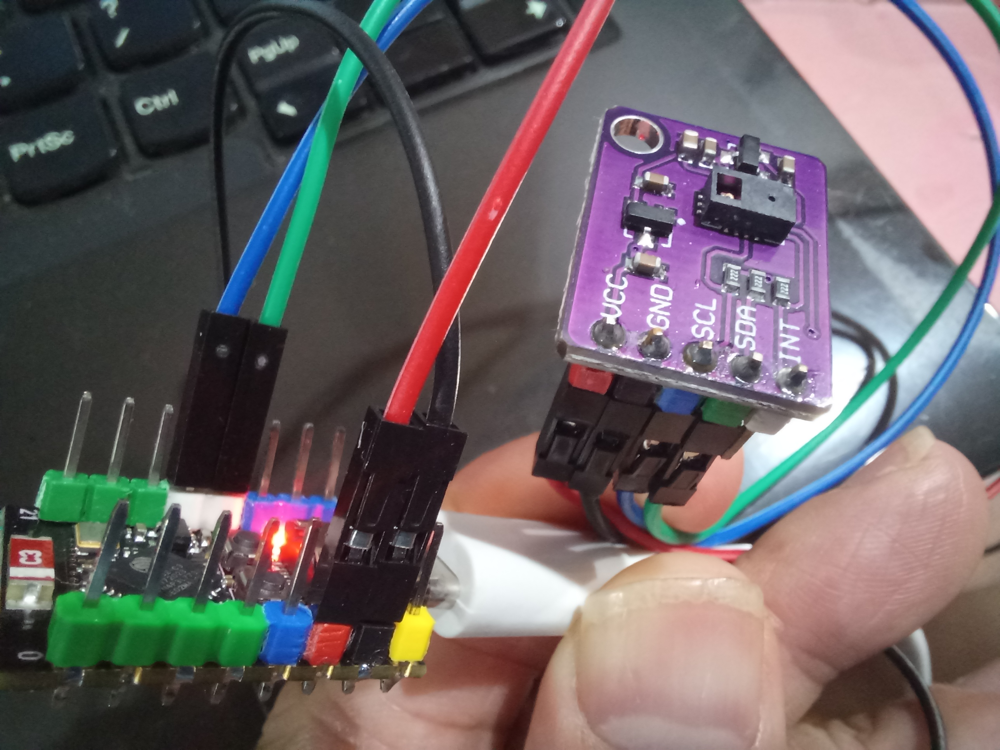
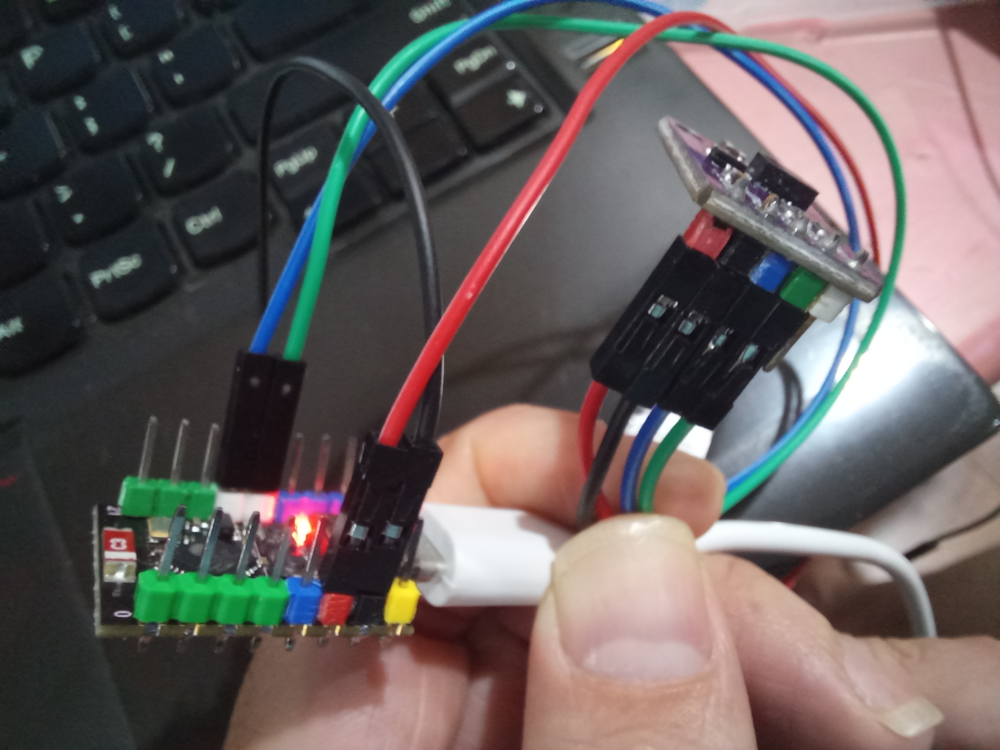
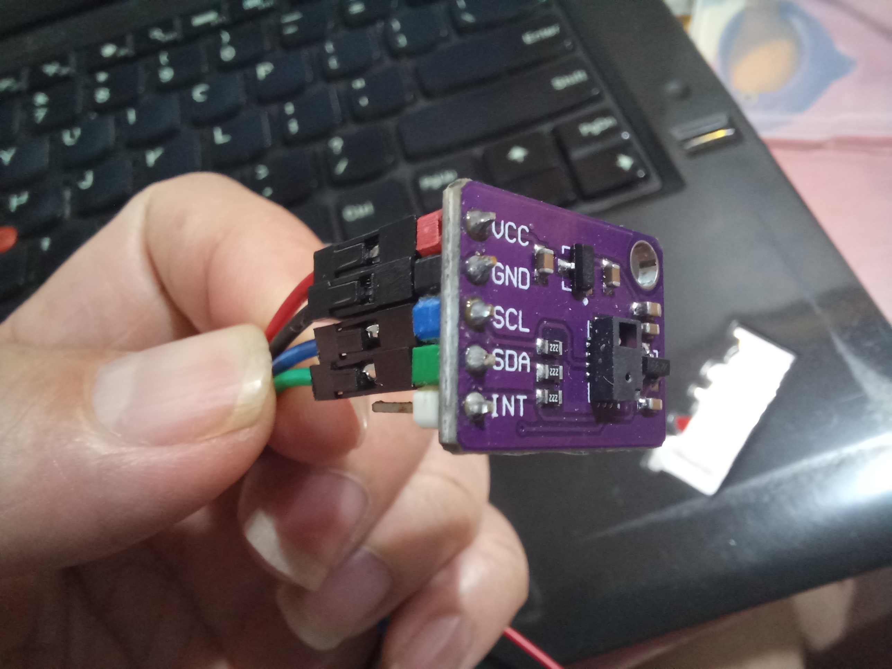
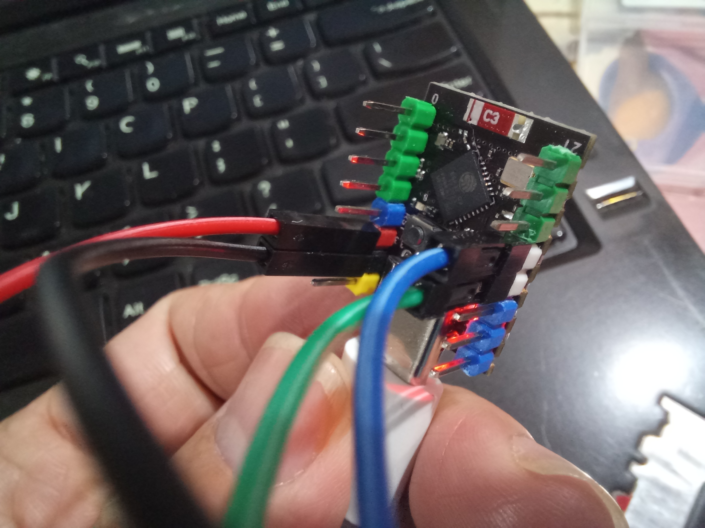

# Module cảm biến 9 cử chỉ bằng hồng ngoại

- Tên module: PAJ7620
- Giao diện: I2C
- 9 cử chỉ gồm:
    -gạt trái, phải, trên, dưới
    -tiến gần, lùi xa
    -xoay theo chiều kim đồng hồ, ngược đồng hồ
    -vẫy lên xuống, trái phải nhiều lần
- Khoảng cách: chỉ tầm 10 cm
- Môi trường xung quanh: không quá 100k lux.

- 
- 
- 
- 
- 
